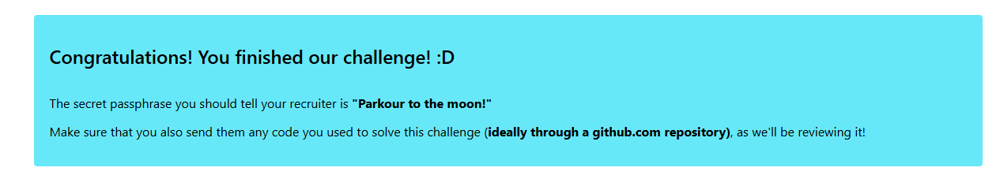

# Crossmint Megaverse – Code Challenge

Automation scripts to solve the Crossmint challenge with TypeScript. Uses `.env` for config and has retries + concurrency built‑in.

## Setup

```bash
npm install
# If you don't have them yet (recommended):
npm i -D typescript ts-node
```

Create **.env** (same folder):

```env
CANDIDATE_ID=YOUR-CANDIDATE-ID
BASE_URL=https://challenge.crossmint.io/api
CONCURRENCY=8
DRY_RUN=false
```

## Run

Your `package.json` exposes two commands:

```bash
npm run phase1   # builds the centered X of Polyanets (phase1/polyanets.ts)
npm run phase2   # builds from the goal map (phase2/solorsystem.ts)
```

> Note: These scripts expect **ts-node**. If it’s not installed, add `npm i -D ts-node typescript`.

## Project Info

* **Type**: commonjs
* **Env**: loaded via `dotenv`
* **Node**: v18+ recommended; for older Node, the scripts include a `fetch` fallback.

## Troubleshooting

* **Unknown file extension ".ts"** → Use `npm run phase1/phase2` or install `ts-node`.
* **429 Too Many Requests** → Lower `CONCURRENCY` in `.env`.




— Thomas
